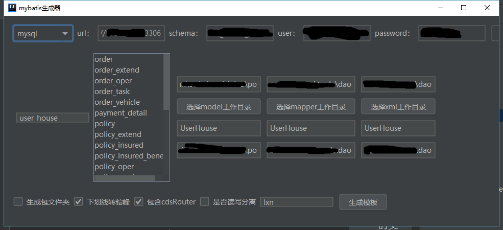

# mybatis-generate-lxn

根据mybatis-generate插件修改而来,原作者地址 :https://gitee.com/rohou


定制化修改如下：

1. 删除无用的空mapper
2. 增加对 mybatis-paginator 的支持,参考 https://github.com/miemiedev/mybatis-paginator
3. 增加批量插入
4. 增加insert (...) values(...) ON DUPLICATE KEY UPDATE a=b,c=d,e=f
5. 增加对CDSRouter的支持(内部功能)



生成的mapper 如下：
```
@Mapper
public interface ModelInfoBaseMapper {

    int insert(ModelInfo object);

    int insertBatch(@Param("list") List<ModelInfo> object);

    int updateById(ModelInfo object);

    int update(ModelInfo.UpdateBuilder object);

    int insertOrUpdate(@Param("add")ModelInfo insert,@Param("set")ModelInfo update);

    PageList<ModelInfo> query(@Param("object")ModelInfo object);

    PageList<ModelInfo> query(@Param("object")ModelInfo object,PageBounds pageBounds);

    Long queryCount(@Param("object")ModelInfo object);

    ModelInfo queryOne(ModelInfo object);


}

```

使用方法：下载relase 

https://github.com/xiananliu/mybatis-generator-lxn/releases/download/1.0.0/freemarker-ftl-1.0-SNAPSHOT.jar

jre环境下双击执行！

