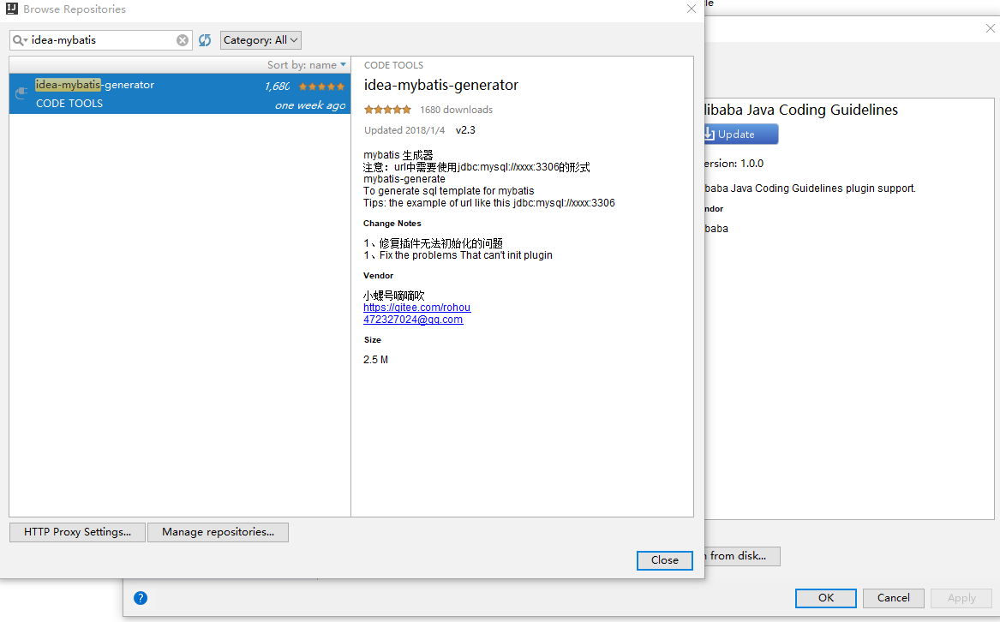
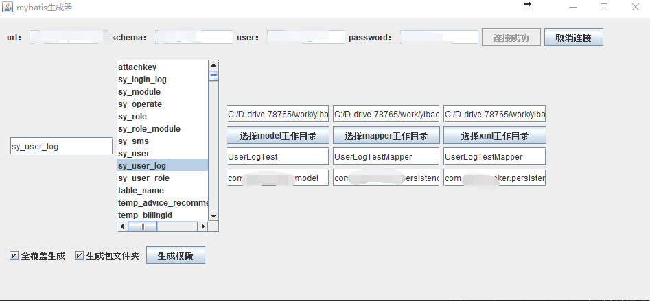
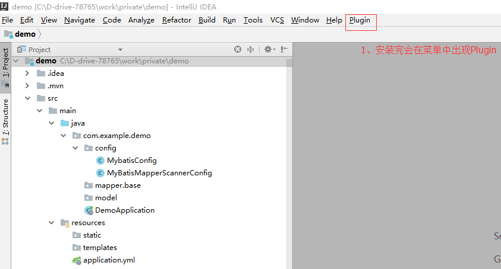

# mybatis-generate

#### 项目介绍

1.  自定义生成mybatis ，可以自己控制模板

2.  db目录下的main文件运行即可

3.  借鉴 Mybatis-generator的思想

4.  insert、update、query生成  主键查询生成XXXById

5.  自由控制sql的返回的属性集，通过fetchXXX，或者excludeXXX控制  通过Builder构建查询

 *已经支持postgresql常用操作*

#### 安装教程

1.  插件已经集成到idea中，可以通过idea插件库下载

#### 使用说明
1. 程序主页

2. 生成代码使用

3. 具体使用请查询example目录
#### 参与贡献

1. 暂无

#### 码云特技

1. 其他idea插件 [EnumGenerator](https://gitee.com/rohou/EnumGenerator)